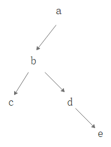
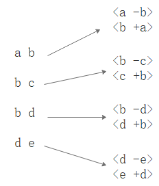
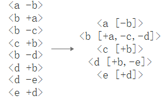
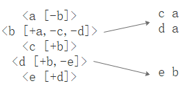

# 第7次作业设计报告

## 题目一

### 1.  计算每个学生必修课的平均成绩

#### Map阶段

首先将一行字符串以`,`分割，例如`"170315班,史伦泰,计算机图形学,选修,82"`分为`["170315班","史伦泰","计算机图形学","选修","82"]`

```python
splitData = textData.map(lambda line:line.split(","))
```

过滤掉选修课

```python
filtData = splitData.filter(lambda lst: lst[3] == "必修")
```

将RDD中每个元素处理为`<课程名, [成绩,1]>`

```python
flagData = filtData.map(lambda lst: (lst[1], [float(lst[4]), 1]))
```

#### Reduce阶段

按照键值，统计分数的总分数和科目数，得到`<课程名, [总成绩,科目数]>`

```python
countData = flagData.reduceByKey(lambda x, y: [x[0] + y[0], x[1] + y[1]])
```

计算平均成绩

```python
meanData = countData.map(lambda x: (x[0], x[1][0] / x[1][1]))
```

### 2. 按科目统计每个班的平均成绩

#### Map阶段

首先将一行字符串以`,`分割，例如`"170315班,史伦泰,计算机图形学,选修,82"`分为`["170315班","史伦泰","计算机图形学","选修","82"]`

```python
splitData = textData.map(lambda line:line.split(","))
```

将RDD中每个元素处理为`<班级-课程名, [成绩,1]>`

```python
flagData = splitData.map(lambda lst: (lst[0] + '-' + lst[2], [float(lst[4]), 1]))
```

#### Reduce阶段

按照键值，统计分数的总分数和科目数，得到`<班级-课程名, [总成绩,科目数]>`

```python
countData = flagData.reduceByKey(lambda x, y: [x[0] + y[0], x[1] + y[1]])
```

计算平均成绩

```python
meanData = countData.map(lambda x: (x[0], x[1][0] / x[1][1]))
```

## 题目二

### 找出所有具有grandchild-grandparent关系的人名组

文件中的父子关系可以用树形图表示，如

```
a,b
b,c
b,d
d,e
```

可表示为



可以发现祖孙关系有

```
d	a
c	a
e	b
```

#### Map阶段

将RDD中每个元素处理为`<父, [-子]>`和`<子, [+父]>`（用`+`和`-`区分父子关系）



```python
def f(line):
    lst = line.split(",")
    
    return [(lst[0], ['-' + lst[1]]), (lst[1], ['+' + lst[0]])]

splitData = textData.flatMap(f) 
```

#### Combine阶段



```python
combineData = splitData.reduceByKey(lambda x, y: x + y)
```

#### Reduce阶段

将每一项的`value`（列表）中含有`+`和含有`-`的名称组合起来，形成一条结果

```java
def f2(t):
    grandparent_list = [i[1:] for i in t[1] if i[0] == '+']
    grandchild_list  = [i[1:] for i in t[1] if i[0] == '-']
    
    result = []
    for gp in grandparent_list:
        for gc in grandchild_list:
            result.append((gc, gp))
            
    return result
                
resultData = combineData.flatMap(f2)
```



## 运行方式

以题目一为例

启动HDFS

```bash
start-all
```

运行python脚本

```bash
hadoop fs -mkdir /input1
hadoop fs -put ./input_file_1.txt /input1 
spark-submit p1_1.py
```

输出结果

```bash
chcp 65001
hadoop fs -cat /resultspark1_1/part-00000 >output1_1.txt 2>&1
```

